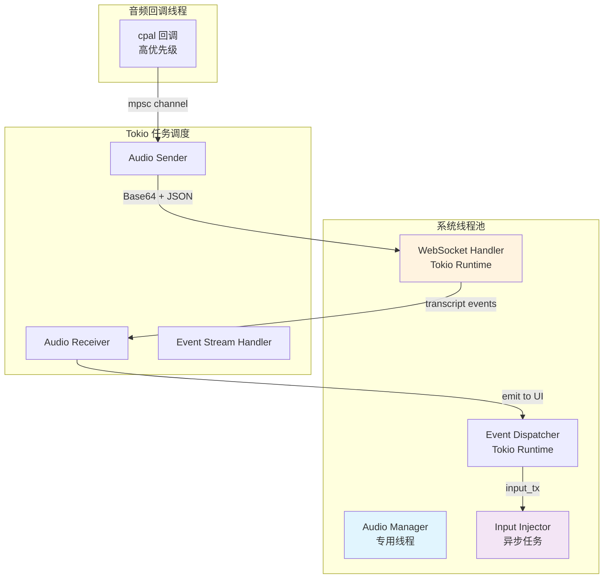
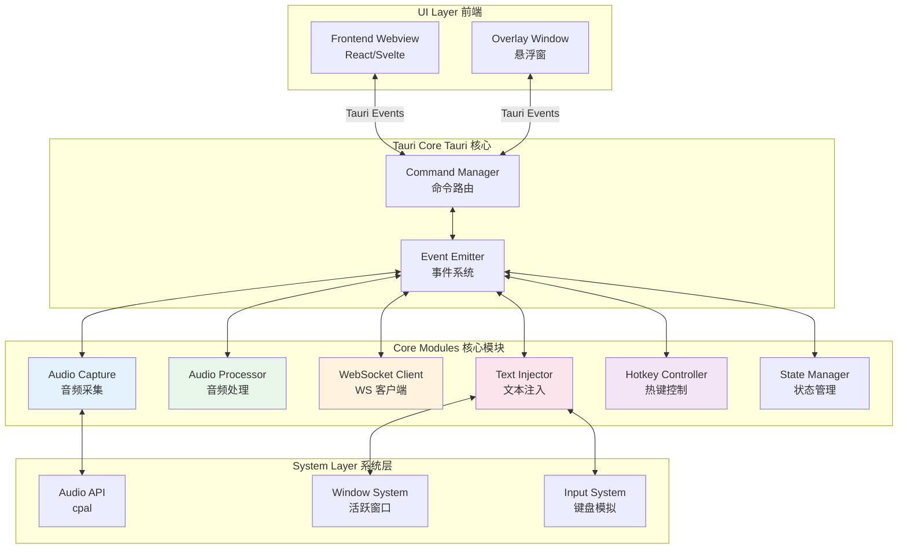
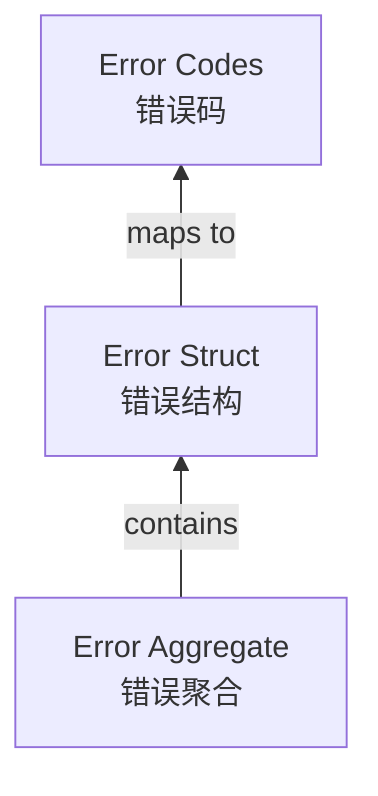
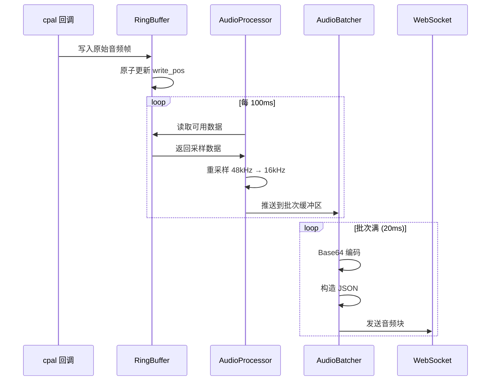
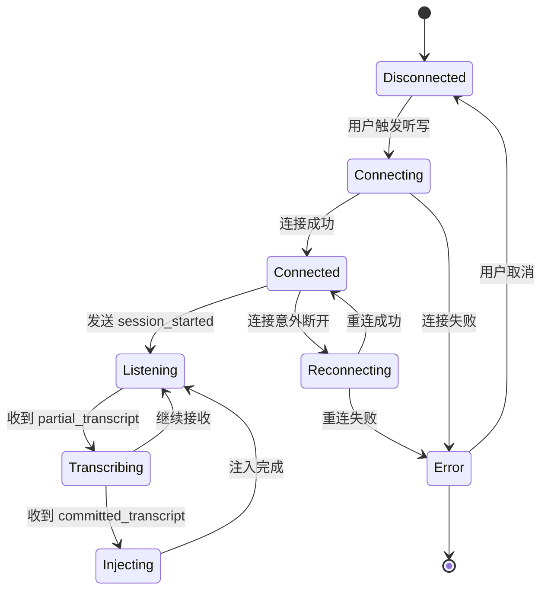
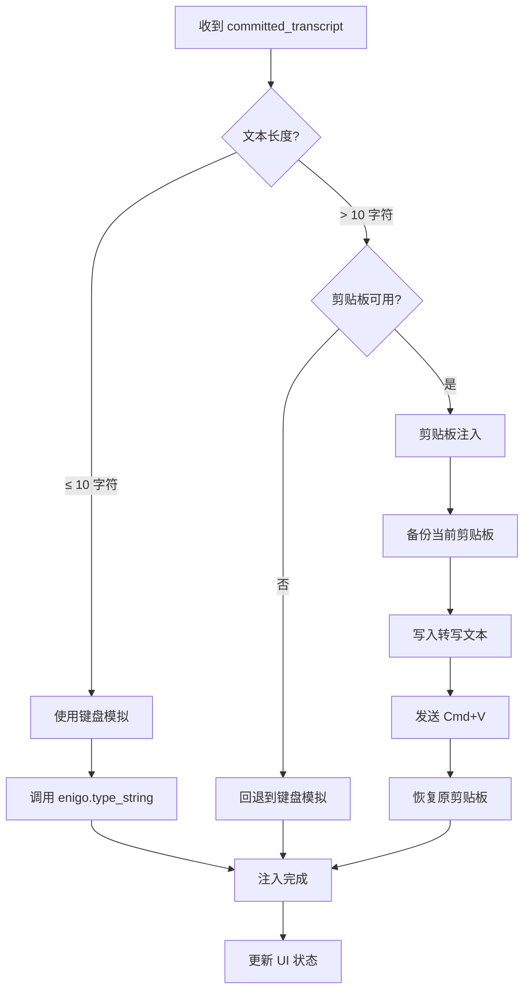
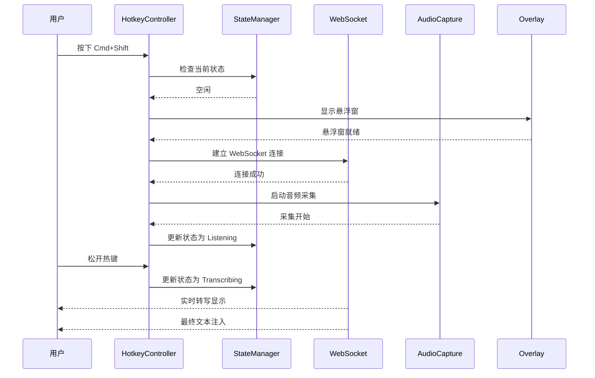
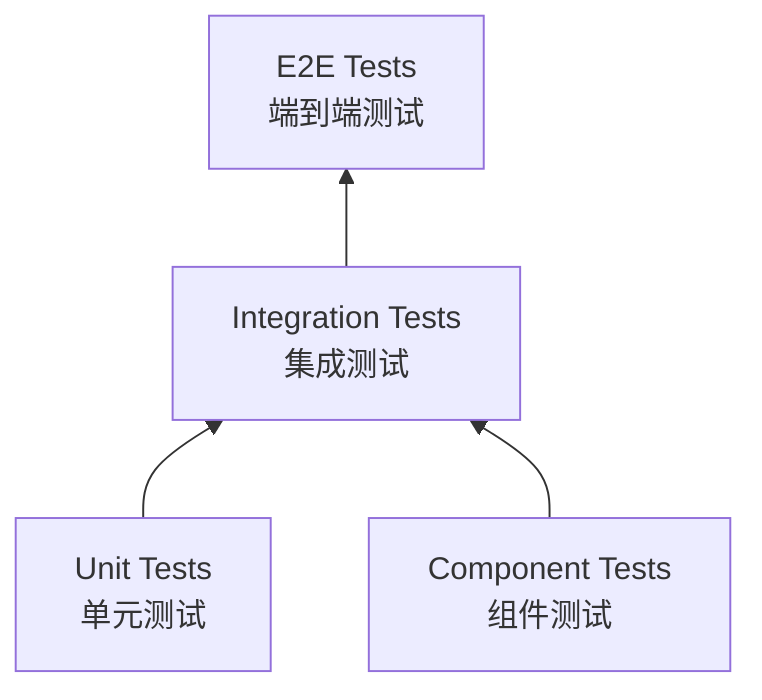
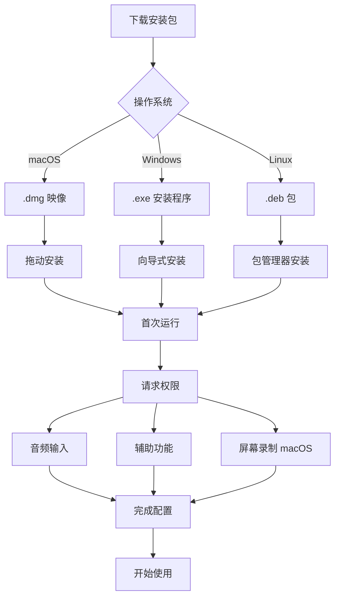

# AudioFlow 详细设计文档

## 文档信息

| 项目 | 内容 |
|------|------|
| 版本 | v1.0.0 |
| 创建日期 | 2025-12-26 |
| 基于规范 | 0001-spec.md |
| 状态 | 初稿 |

---

## 1. 系统概述

### 1.1 项目愿景

AudioFlow 是一个基于 Tauri v2 和 Rust 构建的下一代桌面语音交互系统，类似于 Wispr Flow 的实时听写工具。系统集成 ElevenLabs Scribe v2 Realtime API，实现毫秒级的语音转文本功能，并通过系统级输入注入技术，将识别结果直接输入到用户当前活跃的应用程序中。

### 1.2 核心设计目标

- **低延迟**: 从语音输入到文本呈现的端到端延迟控制在 200ms 以内
- **高可靠性**: 音频采集、网络传输、文本注入全链路具备完善的错误恢复机制
- **资源高效**: 后台常驻时内存占用低于 50MB，CPU 占用低于 5%
- **跨平台支持**: 支持 macOS、Windows、Linux 三大桌面操作系统
- **安全合规**: 所有 API 密钥安全存储，用户数据不持久化

---

## 2. 依赖管理策略

### 2.1 核心依赖版本锁定

根据项目指令，我们使用 Rust 2024 edition，并通过 `Cargo.toml` 的 workspace 机制管理所有依赖。

```toml
# src-tauri/Cargo.toml (核心后端)
[package]
name = "audio-flow-core"
version = "0.1.0"
edition = "2024"

[workspace]
members = ["crates/*"]
resolver = "2"

[dependencies]
# ============ Tauri 生态 ============
tauri = { version = "2.0.2", features = [
    "tray-icon",
    "protocol-asset",
    "image-png",
] }
tauri-plugin-global-shortcut = "2.1.0"
tauri-plugin-clipboard-manager = "2.1.0"
tauri-plugin-dialog = "2.1.0"
tauri-plugin-fs = "2.1.0"
tauri-plugin-shell = "2.1.0"
tauri-plugin-notification = "2.1.0"

# ============ 异步运行时与网络 ============
tokio = { version = "1.41.1", features = [
    "full",
    "tracing",
] }
tokio-tungstenite = { version = "0.28.0", features = [
    "rustls-tls-native-roots",
] }
futures-util = "0.3.31"
hyper = { version = "1.5.0", features = ["client"] }
http = "1.2.0"

# ============ 序列化与配置 ============
serde = { version = "1.0.217", features = ["derive"] }
serde_json = "1.0.140"
serde_yaml = "0.9.34"
toml = "0.8.19"

# ============ 音频处理 ============
cpal = "0.17.0"
rubato = "0.16.2"
hound = "3.5.1"  # WAV 读写，用于调试录制
symphonia = "0.5.4"  # 音频解码，支持更多格式

# ============ 系统底层交互 ============
enigo = "0.3.1"
active-win = "8.0.1"
objc = "0.2.3"
core-foundation = "0.10.0"
windows = { version = "0.58.0", features = ["Win32_UI_Input"] }

# ============ 并发数据结构 ============
crossbeam = "0.8.4"  # 多生产者多消费者通道
dashmap = "6.1.0"    # 并发 HashMap
arc-swap = "1.7.2"   # 线程安全的配置共享
parking_lot = "0.12.3"  # 高性能互斥锁

# ============ 工具库 ============
base64 = "0.22.1"
thiserror = "2.0.9"
anyhow = "1.0.91"
tracing = "0.1.41"
tracing-subscriber = "0.3.19"
chrono = "0.4.38"
dirs = "5.0.1"
lazy_static = "1.5.0"
regex = "1.11.1"

# ============ 加密与安全 ============
rcgen = "0.13.2"
ring = "0.17.8"

[dev-dependencies]
tempfile = "3.14.0"
assert_fs = "1.1.2"
```

### 2.2 依赖安全性审查

所有依赖通过以下机制保证安全性：

| 依赖类别 | 安全措施 | 更新策略 |
|---------|---------|---------|
| **网络** | 使用 `tokio-tungstenite` + `rustls-tls-native-roots` 确保 TLS 1.3 | 每季度审计 |
| **序列化** | 优先使用 `serde`，避免 `bincode` 等非标准格式 | 跟随 Rust 版本更新 |
| **音频** | `cpal` 经过广泛测试，是 Rust 音频事实标准 | 监控上游版本 |
| **系统交互** | 使用官方 Tauri 插件，避免直接 FFI | 通过 Tauri 间接访问 |
| **加密** | 使用 `ring` (WebKit 认证) 和 `rcgen` (证书生成) | 紧急安全补丁 24h 内更新 |

### 2.3 Cargo.lock 管理策略

- **锁定机制**: `Cargo.lock` 必须提交到版本控制
- **更新流程**:
  1. 每月执行 `cargo update --conservative`
  2. 安全更新通过 Dependabot 自动发起
  3. 重大版本更新需要代码审查

---

## 3. 并发模型设计

### 3.1 线程架构

系统采用 **Actor 模型 + 生产者-消费者模式** 的混合架构。



### 3.2 通道选择策略

根据项目指令，我们优先使用 `mpsc` channel 而非共享内存：

| 数据流 | 通道类型 | 选择理由 |
|-------|---------|---------|
| 音频帧 (Audio Callback → Processor) | `tokio::sync::mpsc` | 单生产者，简单可靠，内存可控 |
| 音频帧聚合 | `crossbeam::channel` | 多生产者支持，用于批量发送 |
| 配置共享 | `arc-swap` | 读多写少，极低延迟 |
| 状态同步 | `dashmap` | 多线程需要并发读写 |

```rust
// 核心通道定义
pub struct AudioChannels {
    /// 音频帧传输通道：cpal 回调 → 处理任务
    pub audio_frames: tokio::sync::mpsc::Sender<AudioFrame>,

    /// 批量音频传输：处理任务 → WebSocket 发送
    pub audio_batch: crossbeam::channel::Sender<AudioBatch>,

    /// 事件传输：WebSocket 接收 → UI 更新
    pub events: tokio::sync::mpsc::Sender<TranscriptEvent>,

    /// 输入任务通道：转文本 → 系统注入
    pub text_input: tokio::sync::mpsc::Sender<TextInputRequest>,
}
```

### 3.3 环形缓冲区设计

为避免频繁的内存分配，我们使用预分配的环形缓冲区：

```rust
use std::sync::Arc;
use parking_lot::Mutex;

/// 预分配的环形音频缓冲区
pub struct RingBuffer {
    buffer: Arc<Mutex<Vec<f32>>>,
    capacity: usize,
    write_pos: Arc<AtomicUsize>,
    read_pos: Arc<AtomicUsize>,
}

impl RingBuffer {
    /// 创建指定容量的环形缓冲区
    pub fn new(capacity: usize) -> Self {
        Self {
            buffer: Arc::new(Mutex::new(vec![0.0; capacity])),
            capacity,
            write_pos: Arc::new(AtomicUsize::new(0)),
            read_pos: Arc::new(AtomicUsize::new(0)),
        }
    }

    /// 线程安全写入
    pub fn write(&self, data: &[f32]) -> usize {
        let mut buf = self.buffer.lock();
        let write_idx = self.write_pos.load(Ordering::SeqCst);

        for (i, &sample) in data.iter().enumerate() {
            let idx = (write_idx + i) % self.capacity;
            buf[idx] = sample;
        }

        self.write_pos.store((write_idx + data.len()) % self.capacity, Ordering::SeqCst);
        data.len()
    }

    /// 批量读取用于发送
    pub fn read_batch(&self, size: usize) -> Option<Vec<f32>> {
        let read_idx = self.read_pos.load(Ordering::SeqCst);
        let write_idx = self.write_pos.load(Ordering::SeqCst);

        let available = if write_idx >= read_idx {
            write_idx - read_idx
        } else {
            self.capacity - read_idx + write_idx
        };

        if available < size {
            return None;
        }

        let mut result = Vec::with_capacity(size);
        let buf = self.buffer.lock();

        for i in 0..size {
            let idx = (read_idx + i) % self.capacity;
            result.push(buf[idx]);
        }

        self.read_pos.store((read_idx + size) % self.capacity, Ordering::SeqCst);
        Some(result)
    }
}
```

### 3.4 Tokio Runtime 配置

```rust
use tokio::runtime::Builder;
use std::thread;

pub fn create_audio_runtime() -> tokio::runtime::Runtime {
    Builder::new_multi_thread()
        .worker_threads(4)
        .thread_name("audio-flow-tokio")
        .max_blocking_threads(2)  // 限制阻塞线程，留给 Base64 编码
        .on_thread_spawn(|_| {
            // 每个工作线程初始化时调用
            tracing::trace!("Tokio worker thread spawned");
        })
        .build()
        .expect("Failed to create Tokio runtime")
}

/// 创建专用运行时用于音频回调
pub fn create_audio_callback_thread() -> std::thread::JoinHandle<()> {
    thread::Builder::new()
        .name("audio-callback".to_string())
        .spawn(|| {
            // 音频回调在高优先级线程运行
            // 不使用 Tokio，避免调度延迟
            loop {
                std::hint::spin_loop();
            }
        })
        .expect("Failed to spawn audio callback thread")
}
```

---

## 4. 模块划分与接口设计

### 4.1 系统架构图



### 4.2 模块职责定义

```
src-tauri/src/
├── lib.rs                    # 入口点，初始化所有模块
├── error.rs                  # 统一错误类型定义
├── state.rs                  # 全局状态管理
├── commands/                 # Tauri 命令实现
│   ├── mod.rs
│   ├── audio_commands.rs     # 音频相关命令
│   ├── config_commands.rs    # 配置相关命令
│   └── hotkey_commands.rs    # 热键相关命令
├── modules/
│   ├── audio/                # 音频处理模块
│   │   ├── mod.rs
│   │   ├── capture.rs        # cpal 音频采集
│   │   ├── resampler.rs      # rubato 重采样
│   │   └── vad.rs            # 语音活动检测
│   ├── network/
│   │   ├── mod.rs
│   │   ├── websocket.rs      # WebSocket 客户端
│   │   └── scribe_client.rs  # ElevenLabs API 封装
│   ├── input/
│   │   ├── mod.rs
│   │   ├── keyboard.rs       # 键盘模拟 (enigo)
│   │   ├── clipboard.rs      # 剪贴板注入
│   │   └── window.rs         # 活跃窗口检测
│   ├── config/
│   │   ├── mod.rs
│   │   ├── manager.rs        # 配置管理
│   │   └── schema.rs         # 配置 Schema
│   └── shortcut/
│       ├── mod.rs
│       └── manager.rs        # 全局热键管理
└── events/
    ├── mod.rs
    ├── audio_events.rs       # 音频事件定义
    └── transcript_events.rs  # 转写事件定义
```

### 4.3 核心接口定义

#### 4.3.1 音频采集接口

```rust
use thiserror::Error;
use cpal::SampleFormat;

/// 音频采集模块的错误类型
#[derive(Debug, Error)]
pub enum AudioCaptureError {
    #[error("No input device available")]
    NoDevice,

    #[error("Device configuration failed: {0}")]
    ConfigurationFailed(String),

    #[error("Stream creation failed: {0}")]
    StreamCreationFailed(String),

    #[error("Audio callback error: {0}")]
    CallbackError(String),
}

/// 音频设备信息
#[derive(Debug, Clone)]
pub struct AudioDeviceInfo {
    pub name: String,
    pub id: String,
    pub sample_rates: Vec<u32>,
    pub channels: u16,
    pub sample_format: SampleFormat,
}

/// 音频采集器 trait
pub trait AudioCapturer: Send {
    /// 获取可用的输入设备列表
    fn available_devices(&self) -> Result<Vec<AudioDeviceInfo>, AudioCaptureError>;

    /// 获取默认输入设备
    fn default_device(&self) -> Result<AudioDeviceInfo, AudioCaptureError>;

    /// 开始采集音频
    fn start_capture<F>(&mut self, callback: F) -> Result<(), AudioCaptureError>
    where
        F: FnMut(&[f32]) + Send + 'static;

    /// 停止采集
    fn stop_capture(&mut self) -> Result<(), AudioCaptureError>;

    /// 检查是否正在采集
    fn is_capturing(&self) -> bool;
}

/// 音频配置
#[derive(Debug, Clone)]
pub struct AudioConfig {
    pub device_id: Option<String>,
    pub sample_rate: u32,
    pub channels: u16,
    pub buffer_size_ms: u32,
}
```

#### 4.3.2 WebSocket 客户端接口

```rust
use tokio_tungstenite::WebSocketStream;
use futures::stream::SplitSink;
use tokio::sync::mpsc;

/// ElevenLabs WebSocket 消息
#[derive(Debug, Clone, serde::Serialize, serde::Deserialize)]
#[serde(tag = "message_type")]
pub enum ScribeMessage {
    #[serde(rename = "input_audio_chunk")]
    InputAudioChunk {
        audio_base_64: String,
    },
    #[serde(rename = "stop_request")]
    StopRequest,
    #[serde(rename = "flush_request")]
    FlushRequest,
}

/// ElevenLabs 事件
#[derive(Debug, Clone, serde::Deserialize)]
#[serde(tag = "message_type")]
pub enum ScribeEvent {
    #[serde(rename = "session_started")]
    SessionStarted {
        session_id: String,
        config: serde_json::Value,
    },
    #[serde(rename = "partial_transcript")]
    PartialTranscript {
        text: String,
        created_at_ms: u64,
    },
    #[serde(rename = "committed_transcript")]
    CommittedTranscript {
        text: String,
        confidence: f64,
    },
    #[serde(rename = "input_error")]
    InputError {
        error_message: String,
    },
}

/// WebSocket 客户端错误
#[derive(Debug, Error)]
pub enum WebSocketError {
    #[error("Connection failed: {0}")]
    ConnectionFailed(String),

    #[error("Authentication failed")]
    AuthenticationFailed,

    #[error("Connection lost: {0}")]
    ConnectionLost(String),

    #[error("Send failed: {0}")]
    SendFailed(String),
}

/// WebSocket 客户端 trait
pub trait ScribeClient: Send {
    /// 连接到 ElevenLabs API
    async fn connect(
        &self,
        api_key: &str,
    ) -> Result<(), WebSocketError>;

    /// 发送音频数据
    async fn send_audio(&self, audio_data: &[f32]) -> Result<(), WebSocketError>;

    /// 停止发送
    async fn stop(&self) -> Result<(), WebSocketError>;

    /// 接收事件流
    fn event_receiver(&self) -> mpsc::Receiver<ScribeEvent>;

    /// 检查连接状态
    fn is_connected(&self) -> bool;

    /// 断开连接
    async fn disconnect(&self);
}
```

#### 4.3.3 文本注入接口

```rust
/// 文本注入方法
#[derive(Debug, Clone, Copy, PartialEq, Eq)]
pub enum InjectionMethod {
    /// 键盘模拟输入
    Keyboard,
    /// 剪贴板注入
    Clipboard,
    /// 自动选择最优方法
    Auto,
}

/// 文本注入请求
#[derive(Debug)]
pub struct TextInputRequest {
    pub text: String,
    pub method: InjectionMethod,
    pub priority: u8,
}

/// 文本注入错误
#[derive(Debug, Error)]
pub enum TextInjectionError {
    #[error("No active window found")]
    NoActiveWindow,

    #[error("Permission denied: {0}")]
    PermissionDenied(String),

    #[error("Injection failed: {0}")]
    InjectionFailed(String),

    #[error("Clipboard restore failed")]
    ClipboardRestoreFailed,
}

/// 文本注入 trait
pub trait TextInjector: Send {
    /// 获取当前活跃窗口信息
    fn get_active_window(&self) -> Result<ActiveWindowInfo, TextInjectionError>;

    /// 执行文本注入
    async fn inject_text(&self, request: TextInputRequest) -> Result<(), TextInjectionError>;

    /// 检查所需权限
    fn check_permissions(&self) -> PermissionStatus;

    /// 请求权限（如果需要）
    async fn request_permissions(&self) -> Result<(), TextInjectionError>;
}

/// 活跃窗口信息
#[derive(Debug, Clone)]
pub struct ActiveWindowInfo {
    pub process_id: u32,
    pub app_name: String,
    pub window_title: String,
    pub is_editable: bool,
}
```

#### 4.3.4 配置管理接口

```rust
use arc_swap::ArcSwap;

/// 用户配置结构
#[derive(Debug, Clone, serde::Serialize, serde::Deserialize)]
pub struct UserConfig {
    /// API 设置
    pub api: ApiConfig,

    /// 音频设置
    pub audio: AudioSettings,

    /// 输入设置
    pub input: InputSettings,

    /// 快捷键设置
    pub hotkeys: HotkeySettings,

    /// UI 设置
    pub ui: UiSettings,
}

/// API 配置
#[derive(Debug, Clone, serde::Serialize, serde::Deserialize)]
pub struct ApiConfig {
    pub elevenlabs_api_key: Option<String>,  // 空表示未配置
    pub language_code: String,
    pub model_id: String,
}

/// 音频设置
#[derive(Debug, Clone, serde::Serialize, serde::Deserialize)]
pub struct AudioSettings {
    pub input_device: Option<String>,
    pub sample_rate: u32,
    pub noise_suppression: bool,
    pub auto_gain: bool,
}

/// 输入设置
#[derive(Debug, Clone, serde::Serialize, serde::Deserialize)]
pub struct InputSettings {
    pub injection_method: InjectionMethod,
    pub auto_hide_overlay: bool,
    pub keyboard_typing_speed: u8,
    pub clipboard_restore: bool,
}

/// 快捷键设置
#[derive(Debug, Clone, serde::Serialize, serde::Deserialize)]
pub struct HotkeySettings {
    pub listen_key: String,
    pub listen_modifiers: Vec<String>,
}

/// UI 设置
#[derive(Debug, Clone, serde::Serialize, serde::Deserialize)]
pub struct UiSettings {
    pub overlay_opacity: f64,
    pub overlay_position: OverlayPosition,
    pub theme: Theme,
}

/// 配置管理器 trait
pub trait ConfigManager: Send {
    /// 获取当前配置（线程安全）
    fn current_config(&self) -> Arc<UserConfig>;

    /// 更新配置
    async fn update_config(&self, config: UserConfig) -> Result<(), ConfigError>;

    /// 重置为默认值
    async fn reset_to_defaults(&self) -> Result<(), ConfigError>;

    /// 保存配置到磁盘
    async fn save_config(&self) -> Result<(), ConfigError>;

    /// 从磁盘加载配置
    async fn load_config(&self) -> Result<UserConfig, ConfigError>;
}
```

---

## 5. 数据结构设计

### 5.1 音频数据结构

```rust
/// 单个音频帧（一个缓冲区周期的数据）
#[derive(Debug, Clone)]
pub struct AudioFrame {
    pub samples: Vec<f32>,
    pub timestamp: std::time::Instant,
    pub sample_rate: u32,
    pub channels: u16,
}

/// 批量音频数据（用于网络发送）
#[derive(Debug)]
pub struct AudioBatch {
    pub samples: Vec<f32>,
    pub base64_encoded: Option<String>,
    pub duration_ms: u32,
    pub sequence_number: u64,
}

/// 音频级别（用于 UI 显示）
#[derive(Debug, Clone, Copy)]
pub struct AudioLevel {
    pub rms: f32,           // 均方根值
    pub peak: f32,          // 峰值
    pub dbfs: f32,          // 分贝相对满量程
}

/// 音频统计信息
#[derive(Debug, Default)]
pub struct AudioStats {
    pub frames_captured: u64,
    pub frames_sent: u64,
    pub bytes_sent: u64,
    pub dropped_frames: u64,
    pub latency_ms: f64,
}
```

### 5.2 事件数据结构

```rust
use chrono::DateTime;

/// 应用状态枚举
#[derive(Debug, Clone, PartialEq, Eq)]
pub enum AppState {
    /// 空闲状态
    Idle,
    /// 正在连接
    Connecting,
    /// 正在监听
    Listening,
    /// 正在转写
    Transcribing,
    /// 正在注入
    Injecting,
    /// 错误状态
    Error(String),
}

/// 前端事件载荷
#[derive(Debug, Clone, serde::Serialize)]
#[serde(tag = "event_type")]
pub enum FrontendEvent {
    /// 状态变化
    #[serde(rename = "state_changed")]
    StateChanged {
        old_state: AppState,
        new_state: AppState,
    },

    /// 音频级别更新
    #[serde(rename = "audio_level")]
    AudioLevel {
        level: AudioLevel,
    },

    /// 部分转写更新
    #[serde(rename = "partial_transcript")]
    PartialTranscript {
        text: String,
        timestamp: DateTime<chrono::Utc>,
    },

    /// 完整转写
    #[serde(rename = "committed_transcript")]
    CommittedTranscript {
        text: String,
        confidence: f64,
        timestamp: DateTime<chrono::Utc>,
    },

    /// 错误事件
    #[serde(rename = "error")]
    Error {
        code: String,
        message: String,
        recoverable: bool,
    },

    /// 配置更新
    #[serde(rename = "config_updated")]
    ConfigUpdated,
}
```

### 5.3 状态管理

```rust
use dashmap::DashMap;
use std::sync::Arc;
use tokio::sync::RwLock;

/// 应用运行时状态
#[derive(Debug, Clone)]
pub struct RuntimeState {
    /// 当前应用状态
    pub current_state: Arc<RwLock<AppState>>,

    /// 连接状态
    pub connection_state: Arc<RwLock<ConnectionState>>,

    /// 音频统计
    pub audio_stats: Arc<RwLock<AudioStats>>,

    /// 活跃窗口信息
    pub active_window: Arc<RwLock<Option<ActiveWindowInfo>>>,
}

/// 连接状态
#[derive(Debug, Clone, PartialEq, Eq)]
pub enum ConnectionState {
    Disconnected,
    Connecting,
    Connected,
    Reconnecting,
    Failed(String),
}

/// 全局状态容器
#[derive(Default)]
pub struct GlobalState {
    /// 运行时状态
    pub runtime: RuntimeState,

    /// 配置（使用 ArcSwap 读多写少）
    pub config: ArcSwap<UserConfig>,

    /// 音频采集器实例
    pub audio_capturer: RwLock<Option<Box<dyn AudioCapturer>>>,

    /// WebSocket 客户端实例
    pub scribe_client: RwLock<Option<Box<dyn ScribeClient>>>,

    /// 文本注入器实例
    pub text_injector: RwLock<Option<Box<dyn TextInjector>>},
}

lazy_static! {
    /// 全局状态单例
    pub static ref GLOBAL_STATE: Arc<GlobalState> = Arc::new(GlobalState::default());
}
```

---

## 6. 错误处理策略

### 6.1 错误层次结构



### 6.2 统一错误定义

```rust
use thiserror::Error;
use std::fmt;

/// 应用统一错误类型
#[derive(Debug, Error)]
pub enum AppError {
    /// 音频相关错误
    #[error(transparent)]
    AudioError(#[from] AudioCaptureError),

    /// 网络相关错误
    #[error(transparent)]
    NetworkError(#[from] WebSocketError),

    /// 输入相关错误
    #[error(transparent)]
    InputError(#[from] TextInjectionError),

    /// 配置错误
    #[error(transparent)]
    ConfigError(#[from] ConfigError),

    /// 权限错误
    #[error("Permission denied: {0}")]
    PermissionDenied(String),

    /// 系统错误
    #[error("System error: {0}")]
    SystemError(String),

    /// 用户取消
    #[error("Operation cancelled by user")]
    Cancelled,

    /// 内部错误
    #[error("Internal error: {0}")]
    Internal(String),
}

/// 错误代码（用于前端显示）
#[derive(Debug, Clone, Copy, PartialEq, Eq)]
pub enum ErrorCode {
    // 音频错误 1xxx
    AudioNoDevice = 1001,
    AudioConfigFailed = 1002,
    AudioStreamFailed = 1003,

    // 网络错误 2xxx
    NetworkConnectFailed = 2001,
    NetworkAuthFailed = 2002,
    NetworkLost = 2003,
    NetworkSendFailed = 2004,

    // 输入错误 3xxx
    InputNoWindow = 3001,
    InputPermissionDenied = 3002,
    InputInjectionFailed = 3003,
    InputClipboardFailed = 3004,

    // 配置错误 4xxx
    ConfigLoadFailed = 4001,
    ConfigSaveFailed = 4002,
    ConfigValidationFailed = 4003,
}

/// 可恢复错误的处理策略
#[derive(Debug, Clone)]
pub enum RecoveryStrategy {
    /// 立即重试
    RetryImmediate,
    /// 指数退避重试
    RetryWithBackoff { max_retries: u32, base_delay_ms: u64 },
    /// 降级到备用方案
    Fallback(String),
    /// 提示用户操作
    UserAction(String),
    /// 无法恢复，需要重启
    Fatal,
}
```

### 6.3 错误恢复机制

```rust
/// 错误恢复处理器
pub struct ErrorRecoveryHandler {
    strategies: DashMap<ErrorCode, RecoveryStrategy>,
    retry_count: DashMap<ErrorCode, u32>,
    max_retries: u32,
}

impl ErrorRecoveryHandler {
    pub fn new(max_retries: u32) -> Self {
        let mut strategies = DashMap::new();

        // 配置默认恢复策略
        strategies.insert(ErrorCode::NetworkConnectFailed, RecoveryStrategy::RetryWithBackoff {
            max_retries: 3,
            base_delay_ms: 1000,
        });

        strategies.insert(ErrorCode::NetworkLost, RecoveryStrategy::RetryWithBackoff {
            max_retries: 5,
            base_delay_ms: 500,
        });

        strategies.insert(ErrorCode::InputPermissionDenied, RecoveryStrategy::UserAction(
            "请在系统设置中授予辅助功能权限".to_string()
        ));

        strategies.insert(ErrorCode::AudioNoDevice, RecoveryStrategy::Fatal);

        Self {
            strategies,
            retry_count: DashMap::new(),
            max_retries,
        }
    }

    pub async fn handle_error(&self, error: &AppError) -> Result<(), AppError> {
        let error_code = self.get_error_code(error);

        // 检查是否有恢复策略
        if let Some(strategy) = self.strategies.get(&error_code) {
            return self.execute_strategy(&error_code, &strategy).await;
        }

        // 默认策略：记录日志，返回错误
        tracing::error!("Unhandled error: {:?}", error);
        Err(error.clone())
    }

    async fn execute_strategy(
        &self,
        code: &ErrorCode,
        strategy: &RecoveryStrategy,
    ) -> Result<(), AppError> {
        match strategy {
            RecoveryStrategy::RetryImmediate => {
                tracing::warn!("Retrying immediately for error {:?}", code);
                Ok(())
            }

            RecoveryStrategy::RetryWithBackoff { max_retries, base_delay_ms } => {
                let count = self.retry_count.entry(*code).or_insert(0);
                let retries = *count.value();

                if retries >= *max_retries {
                    self.retry_count.remove(code);
                    return Err(AppError::NetworkError(WebSocketError::ConnectionLost(
                        format!("Max retries ({}) exceeded", max_retries)
                    )));
                }

                *count += 1;
                let delay_ms = base_delay_ms * 2_u64.pow(retries);
                tracing::warn!("Retry {} for error {:?}, waiting {}ms", retries, code, delay_ms);

                tokio::time::sleep(tokio::time::Duration::from_millis(delay_ms)).await;
                Ok(())
            }

            RecoveryStrategy::Fallback(alternative) => {
                tracing::warn!("Falling back to: {}", alternative);
                Ok(())
            }

            RecoveryStrategy::UserAction(message) => {
                // 发送事件给前端显示错误
                GLOBAL_STATE.runtime.current_state.write().await
                    .clone_from(&AppState::Error(message.clone()));
                Err(AppError::PermissionDenied(message.clone()))
            }

            RecoveryStrategy::Fatal => {
                Err(AppError::Internal(format!("Fatal error: {:?}", code)))
            }
        }
    }

    fn get_error_code(&self, error: &AppError) -> ErrorCode {
        match error {
            AppError::AudioError(e) => match e {
                AudioCaptureError::NoDevice => ErrorCode::AudioNoDevice,
                AudioCaptureError::ConfigurationFailed(_) => ErrorCode::AudioConfigFailed,
                AudioCaptureError::StreamCreationFailed(_) => ErrorCode::AudioStreamFailed,
                AudioCaptureError::CallbackError(_) => ErrorCode::AudioStreamFailed,
            },
            AppError::NetworkError(e) => match e {
                WebSocketError::ConnectionFailed(_) => ErrorCode::NetworkConnectFailed,
                WebSocketError::AuthenticationFailed => ErrorCode::NetworkAuthFailed,
                WebSocketError::ConnectionLost(_) => ErrorCode::NetworkLost,
                WebSocketError::SendFailed(_) => ErrorCode::NetworkSendFailed,
            },
            AppError::InputError(e) => match e {
                TextInjectionError::NoActiveWindow => ErrorCode::InputNoWindow,
                TextInjectionError::PermissionDenied(_) => ErrorCode::InputPermissionDenied,
                TextInjectionError::InjectionFailed(_) => ErrorCode::InputInjectionFailed,
                TextInjectionError::ClipboardRestoreFailed => ErrorCode::InputClipboardFailed,
            },
            _ => ErrorCode::NetworkConnectFailed,
        }
    }
}
```

---

## 7. 详细设计流程

### 7.1 音频采集与处理流程



### 7.2 WebSocket 连接与事件处理



### 7.3 文本注入决策流程



### 7.4 热键激活流程



---

## 8. 跨平台兼容性设计

### 8.1 平台差异抽象

```rust
use std::fmt;

/// 平台特定的实现 trait
pub trait PlatformSpecific {
    /// 获取平台类型
    fn platform(&self) -> Platform;

    /// 获取活跃窗口
    fn get_active_window(&self) -> Result<ActiveWindowInfo, TextInjectionError>;

    /// 模拟键盘输入
    fn simulate_keyboard(&self, text: &str) -> Result<(), TextInjectionError>;

    /// 模拟快捷键
    fn simulate_shortcut(&self, keys: &[KeyCode]) -> Result<(), TextInjectionError>;

    /// 检查辅助功能权限
    fn check_accessibility_permission(&self) -> bool;

    /// 请求辅助功能权限
    fn request_accessibility_permission(&self) -> bool;
}

/// 平台枚举
#[derive(Debug, Clone, Copy, PartialEq, Eq)]
pub enum Platform {
    MacOS,
    Windows,
    Linux,
}

/// 平台检测
impl Platform {
    pub fn current() -> Self {
        #[cfg(target_os = "macos")]
        return Platform::MacOS;

        #[cfg(target_os = "windows")]
        return Platform::Windows;

        #[cfg(target_os = "linux")]
        return Platform::Linux;
    }
}
```

### 8.2 平台特定实现

```rust
#[cfg(target_os = "macos")]
mod macos_impl {
    use super::*;
    use active_win::mac::get_active_window;

    impl PlatformSpecific for TextInjector {
        fn platform(&self) -> Platform {
            Platform::MacOS
        }

        fn get_active_window(&self) -> Result<ActiveWindowInfo, TextInjectionError> {
            get_active_window()
                .map(|w| ActiveWindowInfo {
                    process_id: w.pid,
                    app_name: w.app_name,
                    window_title: w.title,
                    is_editable: self.detect_editable(&w),
                })
                .ok_or(TextInjectionError::NoActiveWindow)
        }

        fn simulate_keyboard(&self, text: &str) -> Result<(), TextInjectionError> {
            // 使用 enigo for macOS
            let mut enigo = Enigo::new();
            enigo.text(text)
                .map_err(|e| TextInjectionError::InjectionFailed(e.to_string()))
        }

        fn check_accessibility_permission(&self) -> bool {
            // macOS 辅助功能权限检查
            // 使用 accessibility-sys 或 macos-accessibility-client
            false  // TODO: 实现
        }
    }
}

#[cfg(target_os = "windows")]
mod windows_impl {
    use super::*;
    use active_win::windows::get_active_window;

    impl PlatformSpecific for TextInjector {
        fn platform(&self) -> Platform {
            Platform::Windows
        }

        // Windows 实现...
    }
}

#[cfg(target_os = "linux")]
mod linux_impl {
    use super::*;
    use active_win::linux::get_active_window;

    impl PlatformSpecific for TextInjector {
        fn platform(&self) -> Platform {
            Platform::Linux
        }

        // Linux 实现...
    }
}
```

---

## 9. 安全性设计

### 9.1 API 密钥安全存储

```rust
use tauri::Manager;
use std::fs;

/// 安全存储 API 密钥
pub async fn store_api_key(app: &tauri::AppHandle, api_key: &str) -> Result<(), AppError> {
    // 使用 Tauri 的 secure store
    // 注意：Tauri 2.0 没有内置 secure store，使用系统密钥环

    #[cfg(target_os = "macos")]
    {
        // 使用 Keychain
        let cmd = std::process::Command::new("security")
            .args(&["add-generic-password", "-a", "audio-flow", "-s", "elevenlabs", "-w", api_key])
            .output()
            .map_err(|e| AppError::SystemError(e.to_string()))?;

        if !cmd.status.success() {
            return Err(AppError::SystemError("Failed to store key in Keychain".to_string()));
        }
    }

    #[cfg(target_os = "windows")]
    {
        // 使用 Windows Credential Manager
        // 通过 PowerShell 或第三方库
    }

    Ok(())
}

/// 安全检索 API 密钥
pub async fn get_api_key(app: &tauri::AppHandle) -> Result<Option<String>, AppError> {
    #[cfg(target_os = "macos")]
    {
        let output = std::process::Command::new("security")
            .args(&["find-generic-password", "-a", "audio-flow", "-s", "elevenlabs", "-w"])
            .output()
            .map_err(|e| AppError::SystemError(e.to_string()))?;

        if output.status.success() {
            let key = String::from_utf8_lossy(&output.stdout).trim().to_string();
            return Ok(Some(key));
        }
    }

    Ok(None)
}
```

### 9.2 网络安全

```rust
use tokio_tungstenite::tungstenite::client::ClientBuilder;

/// 创建安全的 WebSocket 连接
async fn create_secure_websocket(url: &str) -> Result<WebSocketStream<tokio::net::TcpStream>, WebSocketError> {
    let (stream, _) = ClientBuilder::new(url)
        .version(tokio_tungstenite::tungstenite::protocol::Version::V13)
        .max_message_size(Some(10 * 1024 * 1024))  // 10MB
        .max_write_buffer_size(Some(10 * 1024 * 1024))
        .connect(url)
        .await
        .map_err(|e| WebSocketError::ConnectionFailed(e.to_string()))?;

    Ok(stream)
}

/// API 密钥通过 Header 传递（不通过 URL）
impl ScribeClient for ScribeWebSocketClient {
    async fn connect(&self, api_key: &str) -> Result<(), WebSocketError> {
        let mut request = http::Request::builder()
            .uri(&self.url)
            .header("xi-api-key", api_key)
            .header("Content-Type", "application/json")
            .method("GET");

        let (stream, response) = connect(request.body(())?).await?;
        // 验证响应状态
    }
}
```

---

## 10. 测试策略

### 10.1 测试层次



### 10.2 测试示例

```rust
#[cfg(test)]
mod audio_buffer_tests {
    use super::*;
    use std::sync::Arc;
    use std::thread;

    #[test]
    fn test_ring_buffer_write_read() {
        let buffer = RingBuffer::new(1024);
        let data = vec![1.0, 2.0, 3.0, 4.0, 5.0];

        buffer.write(&data);

        let read = buffer.read_batch(5).unwrap();
        assert_eq!(read, data);
    }

    #[test]
    fn test_concurrent_write() {
        let buffer = Arc::new(RingBuffer::new(4096));
        let mut handles = vec![];

        for i in 0..4 {
            let buf = buffer.clone();
            handles.push(thread::spawn(move || {
                for j in 0..100 {
                    let data = vec![(i * 100 + j) as f32; 10];
                    buf.write(&data);
                }
            }));
        }

        for handle in handles {
            handle.join().unwrap();
        }

        // 验证没有数据丢失（简化检查）
        assert!(buffer.write_pos.load(Ordering::SeqCst) > 0);
    }
}

#[tokio::test]
async fn test_websocket_reconnection() {
    use tokio::time::timeout;

    let client = ScribeWebSocketClient::new("wss://api.elevenlabs.io/v1/speech-to-text/realtime");

    // 测试连接失败处理
    let result = timeout(Duration::from_secs(5), client.connect("invalid_key")).await;
    assert!(result.is_err() || result.unwrap().is_err());
}
```

---

## 11. 性能优化

### 11.1 音频处理优化

```rust
/// 优化的音频处理管道
pub struct OptimizedAudioPipeline {
    /// 预分配的重采样器
    resampler: rubato::FastFixedIn<rubato::SincFixedOut<f32>>,

    /// 批量编码器
    encoder: base64::Engine,

    /// 零拷贝缓冲区
    batch_buffer: Vec<f32>,
}

impl OptimizedAudioPipeline {
    pub fn new(input_rate: u32, output_rate: u32) -> Self {
        let resampler = rubato::FastFixedIn::new(
            input_rate,
            output_rate,
            rubato::InterpolationParameters {
                sinc_len: 64,
                oversampling_factor: 256,
                window: rubato::WindowFunction::BlackmanHarris,
            },
            1024,  // 预采样大小
            256,   // 输出分块大小
        ).unwrap();

        Self {
            resampler,
            encoder: base64::engine::general_purpose::STANDARD,
            batch_buffer: Vec::with_capacity(3200),  // 200ms @ 16kHz
        }
    }

    /// 处理音频帧，返回 Base64 编码的数据
    pub fn process_and_encode(&mut self, input: &[f32]) -> Option<String> {
        // 重采样
        let resampled = self.resampler.process(input).ok()?;

        // 累积到批次缓冲区
        self.batch_buffer.extend_from_slice(&resampled);

        // 检查是否达到发送阈值 (20ms = 320 采样 @ 16kHz)
        if self.batch_buffer.len() < 320 {
            return None;
        }

        // 转换为 i16
        let i16_data: Vec<i16> = self.batch_buffer.iter()
            .map(|&x| (x.clamp(-1.0, 1.0) * 32767.0) as i16)
            .collect();

        // Base64 编码
        let encoded = self.encoder.encode(&i16_data);

        // 清空缓冲区，保留未使用的数据
        self.batch_buffer.clear();

        Some(encoded)
    }
}
```

### 11.2 内存优化

```rust
/// 内存池用于频繁分配的对象
pub struct MemoryPool {
    audio_frames: crossbeam::queue::SegQueue<Vec<f32>>,
    strings: crossbeam::queue::SegQueue<String>,
}

impl MemoryPool {
    pub fn new() -> Self {
        let pool = Self {
            audio_frames: crossbeam::queue::SegQueue::new(),
            strings: crossbeam::queue::SegQueue::new(),
        };

        // 预分配一些缓冲区
        for _ in 0..100 {
            pool.audio_frames.push(vec![0.0; 1920]);  // 40ms @ 48kHz
        }

        pool
    }

    pub fn get_audio_frame(&self) -> Vec<f32> {
        self.audio_frame.pop().unwrap_or_else(|| vec![0.0; 1920])
    }

    pub fn return_audio_frame(&self, frame: Vec<f32>) {
        // 重置并归还
        self.audio_frames.push(frame);
    }
}
```

---

## 12. 部署与分发

### 12.1 构建配置

```toml
# build.rs - 条件编译配置
fn main() {
    #[cfg(target_os = "macos")]
    {
        println!("cargo:rustc-cfg=feature=\"macos\"");
    }

    #[cfg(target_os = "windows")]
    {
        println!("cargo:rustc-cfg=feature=\"windows\"");
    }

    #[cfg(target_os = "linux")]
    {
        println!("cargo:rustc-cfg=feature=\"linux\"");
    }
}
```

### 12.2 安装程序



---

## 13. 附录

### 13.1 术语表

| 术语 | 定义 |
|------|------|
| ASR | Automatic Speech Recognition，自动语音识别 |
| VAD | Voice Activity Detection，语音活动检测 |
| PCM | Pulse Code Modulation，脉冲编码调制 |
| WSS | WebSocket Secure，加密 WebSocket |
| mpsc | Multi-Producer Single Consumer，多生产者单消费者 |
| DSP | Digital Signal Processing，数字信号处理 |

### 13.2 参考资料

- [ElevenLabs Scribe v2 API 文档](https://elevenlabs.io/docs/speech-to-text)
- [Tauri v2 官方文档](https://v2.tauri.app/)
- [Rust Tokio 运行时文档](https://tokio.rs/tokio/tutorial)
- [CPAL 音频处理库](https://docs.rs/cpal/latest/cpal/)
- [Rubato 重采样库](https://docs.rs/rubato/latest/rubato/)

### 13.3 修订历史

| 版本 | 日期 | 修改内容 |
|------|------|---------|
| v1.0.0 | 2025-12-26 | 初始版本 |
