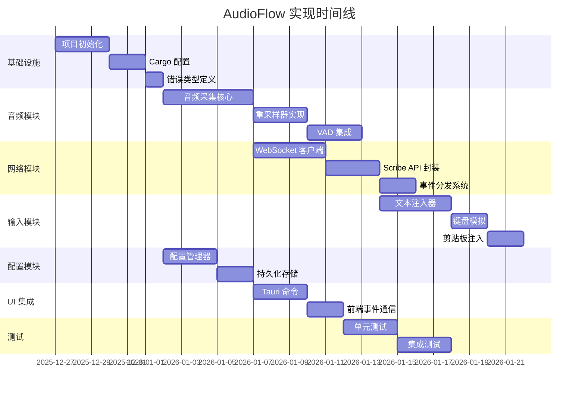

# AudioFlow 实现计划

## 文档信息

| 项目 | 内容 |
|------|------|
| 版本 | v1.0.0 |
| 创建日期 | 2025-12-26 |
| 基于设计 | 0002-design.md |
| 状态 | 初稿 |

---

## 1. 实现阶段概览



---

## 2. 第一阶段：基础设施

### 2.1 项目初始化

**目标**: 建立项目骨架，配置开发环境

#### 任务 2.1.1: 创建 Cargo workspace

```bash
# 创建目录结构
src-tauri/
├── Cargo.toml
├── build.rs
├── src/
│   ├── lib.rs
│   ├── error.rs
│   └── main.rs
├── crates/
│   ├── audio-core/
│   │   └── Cargo.toml
│   ├── network-core/
│   │   └── Cargo.toml
│   └── input-core/
│       └── Cargo.toml
```

**验收标准**:
- [ ] `cargo check` 通过
- [ ] `cargo test` 通过（基础测试）
- [ ] 代码格式化通过 (`cargo fmt`)

#### 任务 2.1.2: 配置 Tauri 2.0

**文件**: `src-tauri/tauri.conf.json`

```json
{
  "productName": "audio-flow",
  "version": "0.1.0",
  "build": {
    "devPath": "../src",
    "beforeDevCommand": "npm run dev",
    "beforeBuildCommand": "npm run build"
  },
  "app": {
    "withGlobalTauri": true,
    "windows": [
      {
        "label": "main",
        "title": "AudioFlow",
        "width": 800,
        "height": 600,
        "resizable": true
      },
      {
        "label": "overlay",
        "title": "Voice Overlay",
        "width": 400,
        "height": 100,
        "decorations": false,
        "transparent": true,
        "alwaysOnTop": true,
        "skipTaskbar": true
      }
    ],
    "trayIcon": {
      "iconPath": "icons/tray.png"
    }
  },
  "bundle": {
    "active": true,
    "targets": "all",
    "identifier": "com.audioflow.app",
    "icon": [
      "icons/32x32.png",
      "icons/128x128.png",
      "icons/128x128@2x.png",
      "icons/icon.icns"
    ]
  }
}
```

**验收标准**:
- [ ] Tauri 窗口正常显示
- [ ] 托盘图标可见
- [ ] 悬浮窗可正常显示/隐藏

#### 任务 2.1.3: 配置 Capabilities

**文件**: `src-tauri/capabilities/default.json`

```json
{
  "$schema": "../gen/schemas/desktop-schema.json",
  "identifier": "default",
  "description": "Default capability for main window",
  "windows": ["main", "overlay"],
  "permissions": [
    "core:default",
    "global-shortcut:allow-register",
    "global-shortcut:allow-is-registered",
    "global-shortcut:allow-unregister",
    "clipboard-manager:allow-write-text",
    "clipboard-manager:allow-read-text",
    "dialog:allow-open",
    "dialog:allow-save",
    "notification:allow-default"
  ]
}
```

### 2.2 错误类型定义

**文件**: `src-tauri/src/error.rs`

```rust
use thiserror::Error;

// 核心错误类型定义
#[derive(Debug, Error)]
pub enum AudioFlowError {
    #[error(transparent)]
    Audio(#[from] AudioError),

    #[error(transparent)]
    Network(#[from] NetworkError),

    #[error(transparent)]
    Input(#[from] InputError),

    #[error(transparent)]
    Config(#[from] ConfigError),

    #[error("{0}")]
    Other(String),
}

#[derive(Debug, Error)]
pub enum AudioError {
    #[error("No input device available")]
    NoDevice,

    #[error("Device configuration failed: {0}")]
    ConfigurationFailed(String),

    #[error("Stream creation failed: {0}")]
    StreamCreationFailed(String),

    #[error("Capture failed: {0}")]
    CaptureFailed(String),
}

#[derive(Debug, Error)]
pub enum NetworkError {
    #[error("Connection failed: {0}")]
    ConnectionFailed(String),

    #[error("Authentication failed")]
    AuthenticationFailed,

    #[error("Connection lost")]
    ConnectionLost,
}

// 验收标准: 所有错误类型都有对应的 unit test
```

---

## 3. 第二阶段：音频模块

### 3.1 音频采集核心

**文件**: `src-tauri/src/modules/audio/capture.rs`

#### 任务 3.1.1: 设备枚举

```rust
pub fn list_input_devices() -> Result<Vec<AudioDeviceInfo>, AudioError> {
    let host = cpal::default_host();
    let devices = host.input_devices()
        .map_err(|e| AudioError::ConfigurationFailed(e.to_string()))?;

    devices
        .filter_map(|d| {
            d.name()
                .ok()
                .map(|name| AudioDeviceInfo {
                    name,
                    id: d.name().unwrap_or_default(),
                    // ... 其他字段
                })
        })
        .collect()
}
```

**验收标准**:
- [ ] 返回可用输入设备列表
- [ ] 包含设备名称、支持的采样率、通道数
- [ ] 处理设备枚举错误

#### 任务 3.1.2: 音频流创建

```rust
pub struct AudioCapturer {
    stream: Option<cpal::Stream>,
    tx: mpsc::Sender<AudioFrame>,
    config: AudioConfig,
}

impl AudioCapturer {
    pub fn new(config: AudioConfig, tx: mpsc::Sender<AudioFrame>) -> Self {
        Self {
            stream: None,
            tx,
            config,
        }
    }

    pub fn start(&mut self) -> Result<(), AudioError> {
        // 创建设备、配置、流
        // 设置回调函数
        // 启动流
    }
}
```

**验收标准**:
- [ ] 能够启动/停止音频采集
- [ ] 回调函数不阻塞
- [ ] 音频帧通过 channel 发送

#### 任务 3.1.3: 环形缓冲区实现

```rust
pub struct RingBuffer {
    buffer: Vec<f32>,
    write_pos: usize,
    read_pos: usize,
    capacity: usize,
}

impl RingBuffer {
    pub fn new(capacity: usize) -> Self { ... }
    pub fn write(&mut self, data: &[f32]) -> usize { ... }
    pub fn read(&mut self, size: usize) -> Option<Vec<f32>> { ... }
    pub fn available(&self) -> usize { ... }
}
```

**验收标准**:
- [ ] 线程安全
- [ ] 无阻塞写入
- [ ] 正确处理环绕

### 3.2 重采样器实现

**文件**: `src-tauri/src/modules/audio/resampler.rs`

#### 任务 3.2.1: 48kHz → 16kHz 重采样

```rust
pub struct AudioResampler {
    resampler: FastFixedIn<SincFixedOut<f32>>,
    input_rate: u32,
    output_rate: u32,
}

impl AudioResampler {
    pub fn new(input_rate: u32, output_rate: u32) -> Result<Self, ResamplerError> {
        let resampler = FastFixedIn::new(
            input_rate,
            output_rate,
            InterpolationParameters { ... },
            480,  // 30ms @ 16kHz
            480,
        )?;
        Ok(Self { resampler, input_rate, output_rate })
    }

    pub fn process(&mut self, input: &[f32]) -> Result<Vec<f32>, ResamplerError> {
        self.resampler.process(input)
    }
}
```

**验收标准**:
- [ ] 48kHz → 16kHz 转换正确
- [ ] 延迟低于 10ms
- [ ] 无音频失真

### 3.3 VAD 集成（可选）

**文件**: `src-tauri/src/modules/audio/vad.rs`

```rust
pub struct VoiceActivityDetector {
    threshold: f32,
    // 使用 silero-vad 或简单的能量检测
}

impl VoiceActivityDetector {
    pub fn new(threshold: f32) -> Self {
        Self { threshold }
    }

    pub fn is_speech(&self, audio_frame: &[f32]) -> bool {
        // 计算 RMS 能量
        let rms: f32 = audio_frame.iter()
            .map(|x| x * x)
            .sum::<f32>()
            .sqrt() / (audio_frame.len() as f32);

        // 转换为 dB
        let dbfs = 20.0 * rms.log10();

        // 阈值判断
        dbfs > self.threshold
    }
}
```

**验收标准**:
- [ ] 静音检测准确
- [ ] 避免误触发

---

## 4. 第三阶段：网络模块

### 4.1 WebSocket 客户端

**文件**: `src-tauri/src/modules/network/websocket.rs`

#### 任务 4.1.1: 连接管理

```rust
pub struct WebSocketClient {
    stream: Option<WebSocketStream<TcpStream>>,
    sink: Option<SplitSink<WebSocketStream<TcpStream>, Message>>,
    receiver: mpsc::Receiver<Message>,
    state: Arc<RwLock<ConnectionState>>,
}

impl WebSocketClient {
    pub async fn connect(&mut self, url: &str, api_key: &str) -> Result<(), NetworkError> {
        let request = Request::builder()
            .uri(url)
            .header("xi-api-key", api_key)
            .body(())?;

        let (stream, response) = connect(request).await?;
        // 验证响应状态
    }
}
```

**验收标准**:
- [ ] 支持连接/断开
- [ ] 正确处理认证失败
- [ ] 自动重连机制

#### 任务 4.1.2: 消息发送

```rust
impl WebSocketClient {
    pub async fn send_message(&self, message: &Message) -> Result<(), NetworkError> {
        if let Some(sink) = &self.sink {
            sink.send(message.clone()).await?;
            Ok(())
        } else {
            Err(NetworkError::ConnectionLost)
        }
    }

    pub async fn send_audio(&self, audio_data: &[f32]) -> Result<(), NetworkError> {
        // 转换为 i16
        let i16_data: Vec<i16> = audio_data.iter()
            .map(|&x| (x.clamp(-1.0, 1.0) * 32767.0) as i16)
            .collect();

        // Base64 编码
        let b64 = general_purpose::STANDARD.encode(&i16_data);

        // 构造 JSON
        let payload = json!({
            "audio_base_64": b64,
            "message_type": "input_audio_chunk"
        });

        self.send_message(&Message::Text(payload.to_string())).await
    }
}
```

**验收标准**:
- [ ] 音频数据正确编码
- [ ] 无消息丢失
- [ ] 批量发送优化

### 4.2 Scribe API 封装

**文件**: `src-tauri/src/modules/network/scribe_client.rs`

```rust
pub struct ScribeClient {
    ws_client: WebSocketClient,
    event_tx: mpsc::Sender<ScribeEvent>,
    config: ScribeConfig,
}

impl ScribeClient {
    pub async fn start_session(&mut self) -> Result<(), NetworkError> {
        let init_config = json!({
            "model_id": self.config.model_id,
            "language_code": self.config.language_code,
            "encoding": "pcm_16000"
        });

        let message = Message::Text(init_config.to_string());
        self.ws_client.send_message(&message).await
    }
}
```

**验收标准**:
- [ ] 支持 session 管理
- [ ] 事件正确解析
- [ ] partial/committed transcript 分发

### 4.3 事件分发系统

**文件**: `src-tauri/src/events/dispatcher.rs`

```rust
pub struct EventDispatcher {
    event_tx: mpsc::Sender<FrontendEvent>,
    app_handle: tauri::AppHandle,
}

impl EventDispatcher {
    pub async fn emit(&self, event: FrontendEvent) {
        if let Err(e) = self.event_tx.send(event).await {
            tracing::error!("Event dispatch failed: {}", e);
        }
    }

    pub async fn emit_to_frontend(&self, label: &str, event: &str, payload: serde_json::Value) {
        self.app_handle
            .emit_to(label, event, payload)
            .unwrap_or_else(|e| tracing::error!("Frontend emit failed: {}", e));
    }
}
```

---

## 5. 第四阶段：输入模块

### 5.1 活跃窗口检测

**文件**: `src-tauri/src/modules/input/window.rs`

```rust
pub struct WindowManager;

impl WindowManager {
    pub fn get_active_window(&self) -> Result<ActiveWindowInfo, InputError> {
        active_win::get_active_window()
            .map(|w| ActiveWindowInfo {
                process_id: w.pid,
                app_name: w.app_name,
                window_title: w.title,
                is_editable: self.detect_editable(&w),
            })
            .ok_or(InputError::NoActiveWindow)
    }

    fn detect_editable(&self, window: &active_win::Window) -> bool {
        // 使用 accessibility API 检测是否为可编辑区域
        // macOS: AXUIElement
        // Windows: UI Automation
        false
    }
}
```

**验收标准**:
- [ ] 获取活跃窗口信息
- [ ] 检测编辑区域（基础实现）

### 5.2 键盘模拟

**文件**: `src-tauri/src/modules/input/keyboard.rs`

```rust
pub struct KeyboardInjector;

impl KeyboardInjector {
    pub fn type_text(&self, text: &str) -> Result<(), InputError> {
        let mut enigo = Enigo::new();
        enigo.text(text)
            .map_err(|e| InputError::InjectionFailed(e.to_string()))
    }

    pub fn type_text_with_delay(&self, text: &str, delay_ms: u64) -> Result<(), InputError> {
        let mut enigo = Enigo::new();
        for c in text.chars() {
            enigo.key_sequence(&c.to_string())?;
            std::thread::sleep(std::time::Duration::from_millis(delay_ms));
        }
        Ok(())
    }
}
```

**验收标准**:
- [ ] 文本正确输入
- [ ] 支持特殊字符
- [ ] 可配置的输入速度

### 5.3 剪贴板注入

**文件**: `src-tauri/src/modules/input/clipboard.rs`

```rust
pub struct ClipboardInjector;

impl ClipboardInjector {
    pub async fn inject(&self, text: &str) -> Result<(), InputError> {
        // 备份当前剪贴板
        let original = tauri::AppHandle::clipboard_manager()
            .read_text()
            .await;

        // 写入新内容
        tauri::AppHandle::clipboard_manager()
            .write_text(text)
            .await
            .map_err(|e| InputError::InjectionFailed(e.to_string()))?;

        // 模拟粘贴
        self.paste()?;

        // 恢复原剪贴板
        if let Some(content) = original {
            let _ = tauri::AppHandle::clipboard_manager()
                .write_text(&content)
                .await;
        }

        Ok(())
    }

    fn paste(&self) -> Result<(), InputError> {
        // 模拟 Cmd+V / Ctrl+V
        let mut enigo = Enigo::new();
        #[cfg(target_os = "macos")]
        enigo.key_sequence("command+v")?;
        #[cfg(target_os = "windows")]
        enigo.key_sequence("control+v")?;
        Ok(())
    }
}
```

**验收标准**:
- [ ] 文本正确注入
- [ ] 剪贴板正确恢复
- [ ] 短文本和长文本都能处理

---

## 6. 第五阶段：配置模块

### 6.1 配置管理器

**文件**: `src-tauri/src/modules/config/manager.rs`

```rust
pub struct ConfigManager {
    config: ArcSwap<UserConfig>,
    config_path: PathBuf,
}

impl ConfigManager {
    pub fn new(config_dir: PathBuf) -> Self {
        let config_path = config_dir.join("config.toml");
        let config = ArcSwap::new(Arc::new(UserConfig::default()));
        Self { config, config_path }
    }

    pub fn load(&self) -> Result<UserConfig, ConfigError> {
        if !self.config_path.exists() {
            return Ok(UserConfig::default());
        }

        let content = fs::read_to_string(&self.config_path)?;
        let config: UserConfig = toml::from_str(&content)?;
        Ok(config)
    }

    pub fn save(&self, config: &UserConfig) -> Result<(), ConfigError> {
        let content = toml::to_string(config)?;
        fs::write(&self.config_path, content)?;
        self.config.store(Arc::new(config.clone()));
        Ok(())
    }

    pub fn current_config(&self) -> Arc<UserConfig> {
        self.config.load()
    }
}
```

**验收标准**:
- [ ] 配置文件正确读写
- [ ] 线程安全访问
- [ ] 默认值处理

### 6.2 API 密钥安全存储

**文件**: `src-tauri/src/modules/config/secure_storage.rs`

```rust
#[cfg(target_os = "macos")]
pub fn store_api_key(key: &str) -> Result<(), ConfigError> {
    let output = std::process::Command::new("security")
        .args(&[
            "add-generic-password",
            "-a", "audio-flow",
            "-s", "elevenlabs",
            "-w", key,
        ])
        .output()?;

    if !output.status.success() {
        return Err(ConfigError::StorageFailed(
            String::from_utf8_lossy(&output.stderr).to_string()
        ));
    }
    Ok(())
}

#[cfg(target_os = "macos")]
pub fn get_api_key() -> Result<Option<String>, ConfigError> {
    let output = std::process::Command::new("security")
        .args(&[
            "find-generic-password",
            "-a", "audio-flow",
            "-s", "elevenlabs",
            "-w",
        ])
        .output()?;

    if output.status.success() {
        Ok(Some(String::from_utf8_lossy(&output.stdout).trim().to_string()))
    } else {
        Ok(None)
    }
}
```

**验收标准**:
- [ ] 密钥正确存储到系统 Keychain
- [ ] 密钥正确检索
- [ ] 无明文存储

---

## 7. 第六阶段：UI 集成

### 7.1 Tauri 命令

**文件**: `src-tauri/src/commands/mod.rs`

```rust
// 音频命令
#[tauri::command]
pub async fn start_capture(
    state: tauri::State<'_, GlobalState>,
    app: tauri::AppHandle,
) -> Result<(), AppError> {
    // 启动音频采集
}

#[tauri::command]
pub async fn stop_capture(
    state: tauri::State<'_, GlobalState>,
) -> Result<(), AppError> {
    // 停止音频采集
}

// 配置命令
#[tauri::command]
pub async fn get_config(
    state: tauri::State<'_, GlobalState>,
) -> Result<UserConfig, AppError> {
    Ok(state.config_manager.current_config())
}

#[tauri::command]
pub async fn update_config(
    state: tauri::State<'_, GlobalState>,
    config: UserConfig,
) -> Result<(), AppError> {
    state.config_manager.save(&config)?;
    Ok(())
}
```

### 7.2 全局热键

**文件**: `src-tauri/src/modules/shortcut/manager.rs`

```rust
pub struct HotkeyManager {
    app: tauri::AppHandle,
    listening: Arc<AtomicBool>,
}

impl HotkeyManager {
    pub fn new(app: tauri::AppHandle) -> Self {
        Self {
            app,
            listening: Arc::new(AtomicBool::new(false)),
        }
    }

    pub fn register(&self, key: &str, modifiers: &[&str]) -> Result<(), HotkeyError> {
        // 使用 tauri-plugin-global-shortcut 注册热键
    }

    pub fn on_hotkey_pressed<F>(&self, callback: F)
    where
        F: FnOnce() + Send + 'static,
    {
        // 处理热键按下事件
    }
}
```

---

## 8. 第七阶段：测试

### 8.1 单元测试

```rust
#[cfg(test)]
mod tests {
    use super::*;

    #[test]
    fn test_ring_buffer_write_read() {
        let mut buffer = RingBuffer::new(1024);
        let data = vec![1.0, 2.0, 3.0];

        let written = buffer.write(&data);
        assert_eq!(written, 3);

        let read = buffer.read(3).unwrap();
        assert_eq!(read, data);
    }

    #[test]
    fn test_config_default() {
        let config = UserConfig::default();
        assert_eq!(config.audio.sample_rate, 16000);
        assert_eq!(config.audio.noise_suppression, true);
    }
}
```

### 8.2 集成测试

```rust
#[tokio::test]
async fn test_websocket_connect() {
    let client = ScribeClient::new();
    // 测试连接逻辑
}
```

---

## 9. 开发检查清单

### 9.1 每日检查

- [ ] 代码编译通过 (`cargo check`)
- [ ] 所有测试通过 (`cargo test`)
- [ ] 无新警告 (`cargo clippy`)
- [ ] 代码格式化 (`cargo fmt`)

### 9.2 提交前检查

- [ ] 添加了必要的测试
- [ ] 更新了文档
- [ ] 提交信息符合规范
- [ ] 所有 CI 检查通过

---

## 10. 附录：任务依赖关系

```
项目初始化
    │
    ├── Cargo 配置
    │       │
    │       └── 错误类型定义
    │               │
    └── 配置模块 ────┼── 音频模块 ─── 网络模块 ─── 输入模块
            │       │       │           │
            │       │       │           └── 测试
            │       │       └── 事件分发系统 ─── UI 集成
            │       └── 持久化存储
```

---

## 11. 验收标准速查表

| 模块 | 核心验收标准 |
|------|-------------|
| **音频采集** | 启动/停止正常，帧数据通过 channel 发送 |
| **重采样** | 48kHz → 16kHz 正确，无明显失真 |
| **WebSocket** | 连接/重连/消息发送正常 |
| **Scribe API** | 事件正确解析和分发 |
| **文本注入** | 键盘/剪贴板方式都能工作 |
| **配置管理** | 持久化正确，线程安全 |
| **热键** | 按键响应正确 |
| **UI 集成** | 事件正确传递给前端 |
